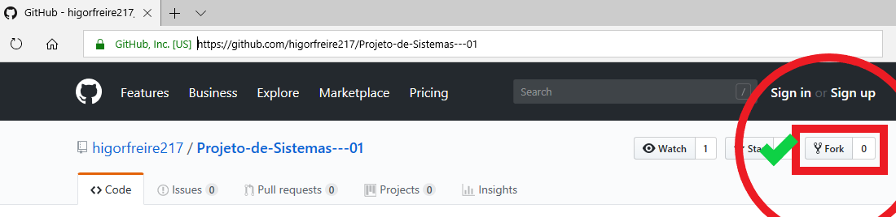
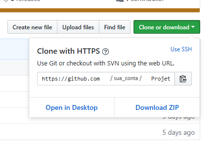

# Fork e pull request.
## Crie o Fork

Para criar um clone desse repositório no Github, por favor, clique em Fork (voce vai precisar de [uma conta aqui](http://www.github.com) e do [git instalado na maquina](https://git-scm.com/book/pt-br/v1/Primeiros-passos-Instalando-Git)).

## Clone o projeto

Depois basta clonar seu repositório usando git clone, copie este endereço com CTRL+C para Windows e Linux ou CMD + C em Macs. Você tambem pode usar o botão ao lado do endereço para copiar.

Usando um `terminal` (no linux ou macs) ou usando o `git bash` para windows digite `git clone` e cole o endereço logo em seguida. Fica algo parecido com isso:

`git clone https://github.com/*sua_conta*/Projeto-de-Sistemas---01.git`

Aguarde ele terminar de baixar, e pronto! Voce já pode começar a trabalhar no seu projeto, e por fim, crie sua branch para evitar conflitos.

## Crie uma branch

Depois de clonar o projeto, navegue pra dentro do diretório com o comando:

`cd Projeto-de-Sistemas---01`

E logo em seguida, crie uma Branch usando seu nome e sobrenome como ultimo argumento, por exemplo: `git checkout -b fernando-noronha` ou `git checkout -b jessica-oliveira`.

Isso vai evitar que possiveis `merges` gerem conflitos.

# Atividade 1

## Herança, Composição, Encapsulamento e Polimorfismo

Uma loja deve manter o cadastro de seus clientes (um cliente, para comprar, precisa estar cadastrado) e deve manter o cadastro de seus empregados.

O cadastro do cliente deve conter:
-   Nome
-   CPF
-   Telefone
-   Data de nascimento
-   Data cadastro
-   Situação (inicial, preferencial, especial)
-   Data última compra
-   Acumulado de compras

O cadastro de empregado deve conter:

### Atendente

-   Nome
-   CPF
-   Carteira de trabalho
-   Data de nascimento
-   Data de contratação
-   Salário
-   Acumulado de comissão

### Caixa
    
-   Nome
-   CPF    
-   Carteira de trabalho    
-   Data de nascimento    
-   Data de contratação    
-   Salário    
-   Diferença Acumulada    

###   Gerente

-   Nome
-   CPF
-   Carteira de trabalho
-   Data de nascimento
-   Data de contratação
-   Salário

Devem ser registrados acumuladores de compra por cliente.

-   Clientes com compras em menos de seis meses acumulam o valor da compra.
-   Os clientes passam de situação inicial para preferencial quando alcançam compras acumuladas maiores de R$ 3.000,00. Para alcançar a situação de especial deve ter compras acumuladas de R$ 10.000,00. O processo de mudança da situação do cliente ocorre após a compra.
-   No mês de aniversário o cliente tem um desconto de 5% que não é cumulativo ao desconto de sua situação.
-   Os atendentes ganham comissão de 8% pelas vendas, o Gerente também pode vender, mas não recebe comissão pela venda
-  As vendas devem ser registradas atualizando acumuladores e data (de empregado, de cliente e de vendas do mês).
-  Na venda deve ser registrado o histórico do mês, apresentando o empregado, o cliente, o valor do produto, o desconto oferecido e a comissão do atendente.
-  O processo de venda não conta com cadastro dos produtos, apenas é informado o preço a ser pago.
-  O relatório de vendas apresenta as vendas do mês, ordenadas por data, apresentando todos os dados do histórico e totalizadores de venda, totalizadores de desconto, totalizadores de comissão e valor líquido de vendas.
-  A listagem de salário não apresenta os descontos legais. Deve aparecer na listagem do pagamento o salário, a comissão, o desconto de diferença de caixa, a bonificação do gerente, valor total e valor líquido.
-  A bonificação do gerente é de 1% do valor líquido de vendas.
